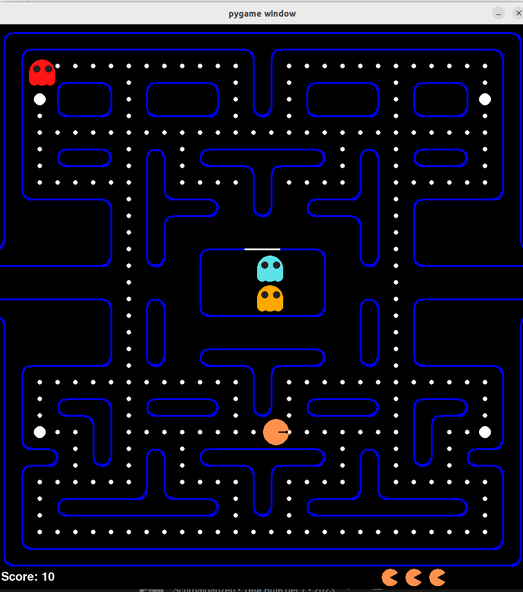

# A classic PacMan game written in python

Make sure to install the required package - pygame:

```pip install -r requirements.txt```

To start the game, run the following command in the terminal:

```python pacman.py```

### Troubleshooting:

The pygame library may not be able to find the needed libraries. If this is the case, run the following command:

```export LD_PRELOAD=/usr/lib/x86_64-linux-gnu/libstdc++.so.6```

Also, it can have library issues when running in pycharm GUI. Better start it from the terminal.

More info: https://stackoverflow.com/questions/71010343/cannot-load-swrast-and-iris-drivers-in-fedora-35



